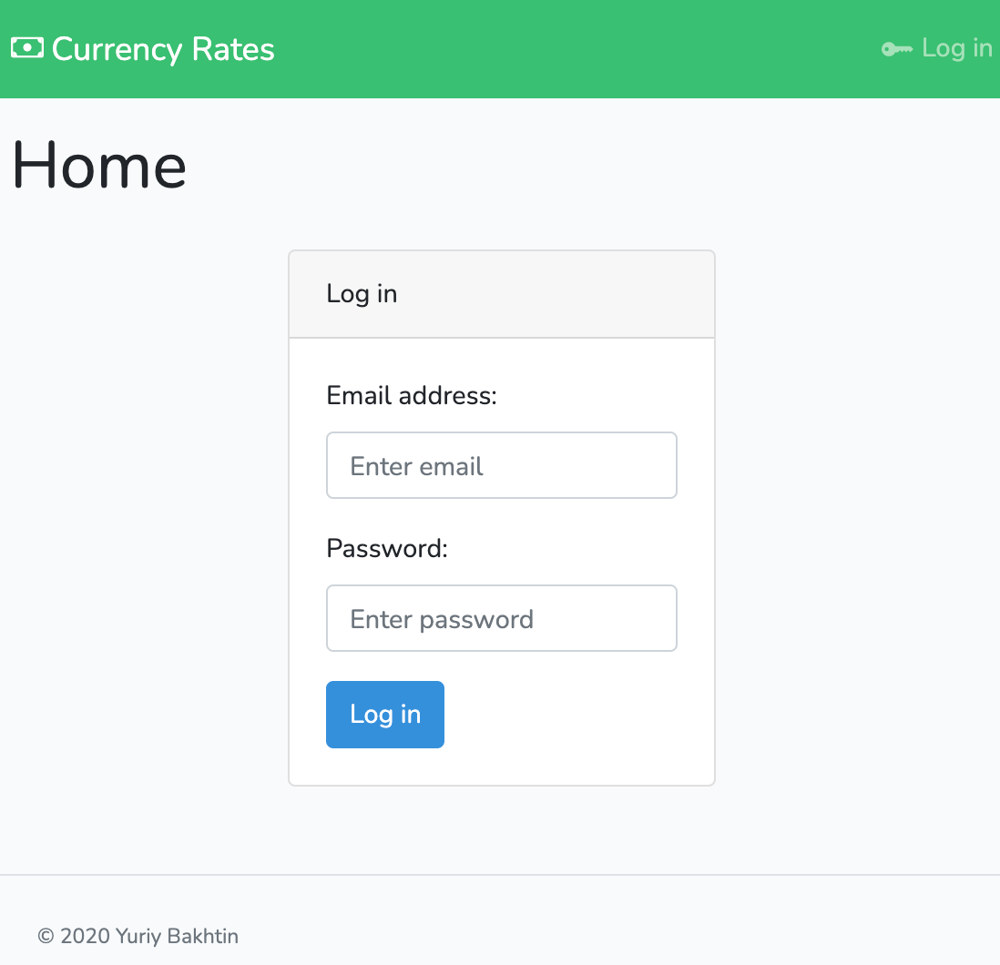

## Currency Rates

Currency Rates is a test web application with import from XML source.
This app is based on PHP framework "Laravel" version 8.x with using JS framework "Vue.js" to render front-office part.


### Installation

- Copy files on your server,
- Create database,
- Create a config file `.env` from `.env.example` and set database:
    ```
    DB_HOST=localhost
    DB_PORT=3306
    DB_DATABASE=your_database_name
    DB_USERNAME=root
    DB_PASSWORD=password
    ``` 
- Go to root directory of this downloaded site,
- Run `npm install` (If command `npm` is not found please read https://docs.npmjs.com/downloading-and-installing-node-js-and-npm),
- Run `composer install` (If command `npm` is not found please read https://getcomposer.org/doc/00-intro.md),
- Run `php artisan key:generate` to generate `APP_KEY` in the config file,
- Run `php artisan config:cache` to clear cache in order to apply changes in the config file,
- Run `php artisan migrate` in order to create tables in your database,
- Setup your http server to the folder `/public` manually or run `php artisan serve` to start it on address http://localhost:8000/.

### Usage

Please create a user by console command in order to log in to front-office part:


#### Sample Data

You can clear and fill your data base with sample data by run a console command `php artisan migrate:fresh --seed` from your project root.

#### Console Commands

- Import currencies with rates from XML: `php artisan currency:import` - a required argument is URL or path to XML file, read more by param `--help`, examples:
  - `php artisan currency:import resources/test/XML_daily.xml`
  - `php artisan currency:import http://www.cbr.ru/scripts/XML_daily.asp`
  - `php artisan currency:import http://www.cbr.ru/scripts/XML_daily.asp?date_req=25/11/2020`
- Create new user: `php artisan user:create` - a required argument is username, read more by param `--help`, examples:
  - `php artisan user:create admin` - Create user `admin` with autogenerated password and email
  - `php artisan user:create admin -p pass` - Create user `admin` with password `pass` and with autogenerated email
  - `php artisan user:create admin -e admin@email.loc` - Create user `admin` with pass same as username and with provided email

#### API endpoints

You can use [postman_collection.json](docs/postman/Currency-Rates.postman_collection.json) and [postman_environment.json](docs/postman/Currency Rates.postman_environment.json) for quick review all implemented endpoints.
- `POST:/token`, params: `email`, `password` // Generate new token for the user

The following endpoints require token authorization:
- `DELETE:/token` // Clean up token from DB of the user
- `GET:/currency`, params: `page`, `page_size`, `date_from`, `date_to` // Get currencies with related rates filtered by dates 
- `GET:/currency/{id}` // Get currency by ID
- `DELETE:/currency/{id}` //  Delete currency by ID
- `GET:/currency/{currencyId}/rate`, params: `page`, `page_size`, `date_from`, `date_to` // Get rates with pagination filtered by dates
- `GET:/currency/{currencyId}/rate/{rateId}` // Get rate by ID
- `DELETE:/currency/{currencyId}/rate/{rateId}` //  Delete rate by ID

#### Tests

Before run tests please create new from `.env.testing` from `.env.sample` and use separately created database in order to set it in the config `DB_DATABASE` there.
Run command `php artisan test`.


Author: **Yuriy Bakhtin**